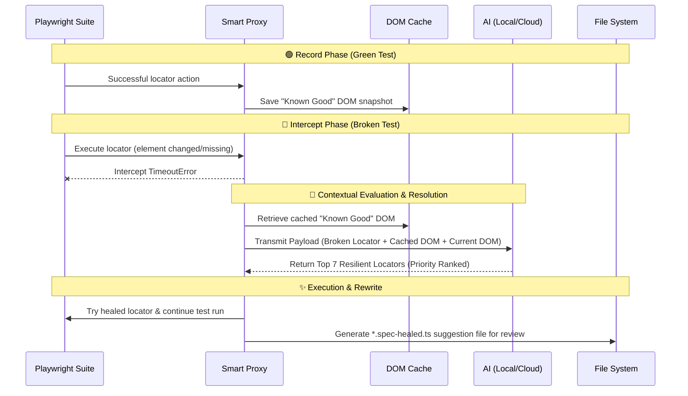

# playwright-smart-locators

[](https://www.npmjs.com/package/@axeforging/playwright-smart-locators)
[](https://www.npmjs.com/package/@axeforging/playwright-smart-locators)
[](https://www.npmjs.com/package/@axeforging/playwright-smart-locators)

**AI-powered developer tool for diagnosing and fixing broken Playwright locators during local development.**

`playwright-smart-locators` helps developers quickly diagnose and fix broken CSS selectors in End-to-End (E2E) test scripts during local development. When a locator fails, it intercepts Playwright's `TimeoutError`, evaluates the broken selector against live and cached DOMs, and uses an AI LLM to suggest a corrected locator. It then generates a `-healed.ts` suggestion file for you to review and adopt into your codebase.

We extensively tested with local 7B models (e.g., **Qwen 2.5 Coder 7B** via Ollama and Open WebUI) to provide robust healing suggestions without significant API costs.

---

## 🔒 Data Privacy & Enterprise Security

For confidential environments or strict data privacy, **exclusively use a local Ollama endpoint** (e.g., `qwen2.5:7b` via local Open WebUI). This prevents DOM data, proprietary class names, or sensitive layouts from leaving your secure network. Cloud providers (OpenAI/Anthropic) are suitable only if testing environments are public or data exfiltration is not a concern.

---

## ⚠️ Important: Development Use Only

This tool is designed for **local development and test maintenance**, not for CI/CD pipelines. Do not enable auto-healing in automated builds or deployment pipelines.

**Why?**

*   **False positives mask real bugs.** If a button genuinely failed to render due to an application regression, the AI may click a different element and report the test as passing — hiding the bug.
*   **CI/CD tests exist to catch regressions.** Auto-healing defeats this purpose by working around failures instead of surfacing them.
*   **AI suggestions require human review.** The healed locators are best-effort suggestions, not guaranteed-correct fixes. A developer should always review the `-healed.ts` files before adopting them.

---

## ✨ Features

*   **Seamless Proxy Interceptor**: Transparently wraps Playwright, catching native timeouts without test logic modification.
*   **Proactive DOM Caching**: Records "Known Good" DOM snapshots before successful actions. When an element breaks, the AI compares historical and current DOMs to identify altered properties.
*   **Healed Suggestion File**: Generates a `*.spec-healed.ts` file with suggested locator fixes alongside your original spec file for you to review and adopt.
*   **Page Object Model (POM) Parsing**: Dynamically parses the JavaScript execution stack. If a locator fails in a POM class (e.g., `login.page.ts`), the AI Healer traces the boundary and rewrites the POM file natively.
*   **Top-7 Fallback Engine**: The AI returns the top 7 most confident locators, prioritized by confidence. The Healer executes these sequentially, allowing smaller models multiple attempts without test suite failure.
*   **Syntactical Sanitization**: A heuristic regex scrubber automatically corrects SASS-like pseudo-class hallucinations (e.g., `tag(class1 class2)` to `tag.class1.class2`) common with quantized local models.
*   **Spec Rewrite Proposals**: Creates an updated `spec-healed.ts` file with proposed locator replacements. Review the suggestions and copy them into your spec files to permanently fix your tests.

---

## 🛠 Usage

### 1. Install the package:

```bash
npm install -D playwright-smart-locators
```

### 2. Wrap your `playwright.config.ts`:

Import the custom auto-healer and configure your Open WebUI or OpenAI-compatible endpoint:

```typescript
import { defineConfig, devices } from '@playwright/test';

export default defineConfig({
    reporter: [
        ['html'],
        ['playwright-smart-locators/dist/reporter'] // Required for Auto-Spec Rewriting
    ],
    use: {
        enableAutoHeal: !process.env.CI, // Enable in local dev, disable in CI/CD
        aiModel: 'qwen2.5:7b', // Local Ollama model for maximum privacy
        aiPipeUrl: process.env.AI_API_URL, // e.g., Open WebUI, OpenAI, or Anthropic endpoint
        aiAdminKey: process.env.AI_API_KEY, // e.g., 'sk-...'
        aiProvider: 'openai' // 'openai' (default) or 'anthropic'
    }
});
```

### 3. Import `test` from the library:

Replace standard Playwright `@playwright/test` imports in your spec files:

```diff
- import { test, expect } from '@playwright/test';
+ import { test, expect } from 'playwright-smart-locators';
```

---

## 🛠 Example Project

The repository includes an `example` testing suite demonstrating Auto-Healer capabilities. These tests target [github.com/axeforging/tacomex-8bit-shop](https://github.com/AxeForging/tacomex-8bit-shop).

To run the examples:

1.  Navigate to the example directory: `cd example`
2.  Install dependencies: `npm install`
3.  Run the tests: `npx playwright test`

### Example Scenarios

The example includes 6 intentionally broken tests that the AI will auto-heal at runtime:

*   **`tests/example.spec.ts`**: 3 standard procedural Playwright tests.
*   **`tests/pom.spec.ts`**: 3 tests using Page Object Model (POM), demonstrating how the Healer rewrites `pages/login.page.ts` natively.

---

## 🚀 Execution Example (Local Development)

During local development, `playwright-smart-locators` provides real-time console feedback on the healing process, detailing actions taken and summarizing generated suggestion files:

```plaintext
Running 6 tests using 6 workers

🤖 [AI Auto-Heal] Intercepted failure on: locator('text="Sign In"')
✅ [AI Auto-Heal] Fixed! Resuming with: .navbar__login-btn
  ✓  2 tests/pom.spec.ts:11:9 › POM Auto-Healing Scenarios › Scenario 1: Text changed (POM Login Button) (5.0s)

...

  6 passed (7.7s)

=========================================
🧠 Smart Locators Summary
=========================================
Total Locators Healed: 6
✨ Generated auto-healed spec: /home/oa/workspace/projects/ai-healing/ai-healer-lib/example/pages/login.page-healed.ts
✨ Generated auto-healed spec: /home/oa/workspace/projects/ai-healing/ai-healer-lib/example/tests/example.spec-healed.ts
```

Review the generated `-healed.ts` files, verify the suggested locators are correct, and adopt them into your spec files.

---

## 🧠 The "Line of Thought" Lifecycle



1.  **Record Phase**: During a successful test run, the library caches a stripped "Known Good" DOM snapshot locally (e.g., `.ai-healer-cache.json`) before successful locator actions.
2.  **Intercept Phase**: If an element changes (e.g., `<button class="btn-primary">` to `<button class="btn-accent">`), the proxy intercepts Playwright's `TimeoutError`.
3.  **Contextual Evaluation**: The proxy sends a payload to the LLM with the **Broken Locator**, **Known Good DOM**, and **Current Broken DOM**.
4.  **Resolution**: The LLM evaluates DOM differences to identify the element and calculates the most resilient new CSS selector based on a strict priority hierarchy.
5.  **Execution & Suggestion**: The library tries the healed locator to continue your test session, and the reporter generates a `-healed.ts` suggestion file for you to review before adopting the fix.

---

## 🧪 Model Experiments & Insights

Our goal was a model providing 100% syntactical CSS accuracy on dense React DOMs with minimal overhead.

*   `llama3.2:3b` - **Failed**: High hallucination rates on complex DOMs, generating fake nested layouts.
*   `gpt-oss:20b` - **Excellent**: Flawless operation without DOM caching restrictions, but financially expensive and GPU-intensive.
*   `qwen2.5-coder:1.5b` and `qwen2.5:3b-instruct` - **Failed**: Small models struggled with strict JSON output, often hallucinating invalid CSS syntax (e.g., `.class1(class2)`).
*   `qwen2.5:7b` - **Optimal**: With Proactive DOM Caching and strict JSON prompt enforcement, this lightweight model achieved 100% perfect healing, offering premium intelligence at a fraction of the cost of 20B+ models.
